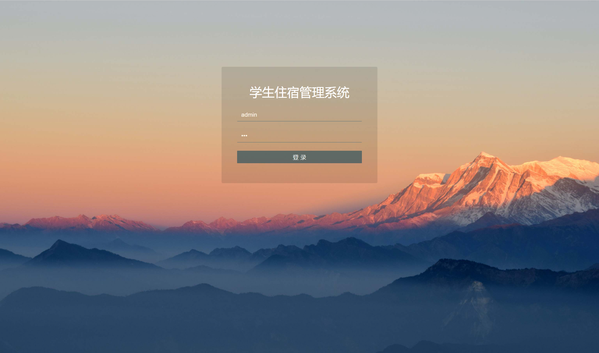
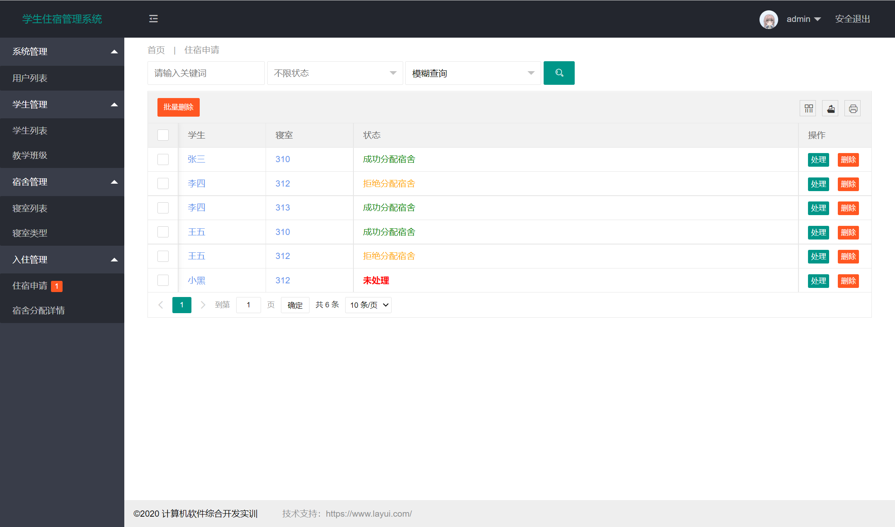
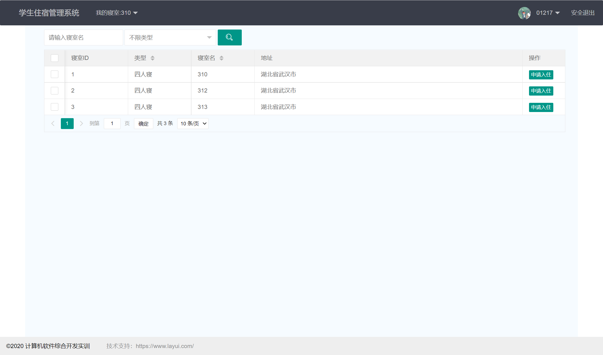
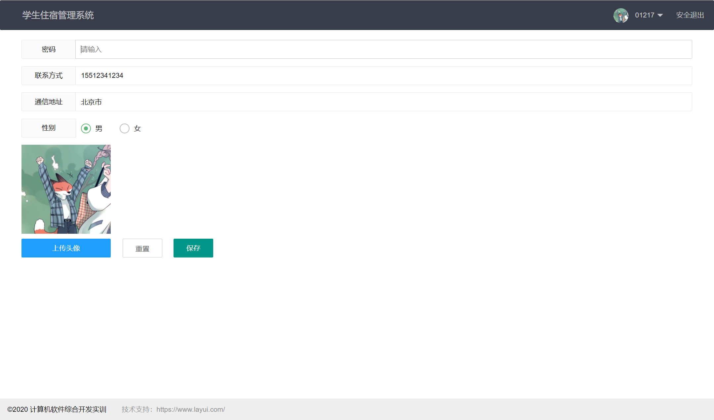
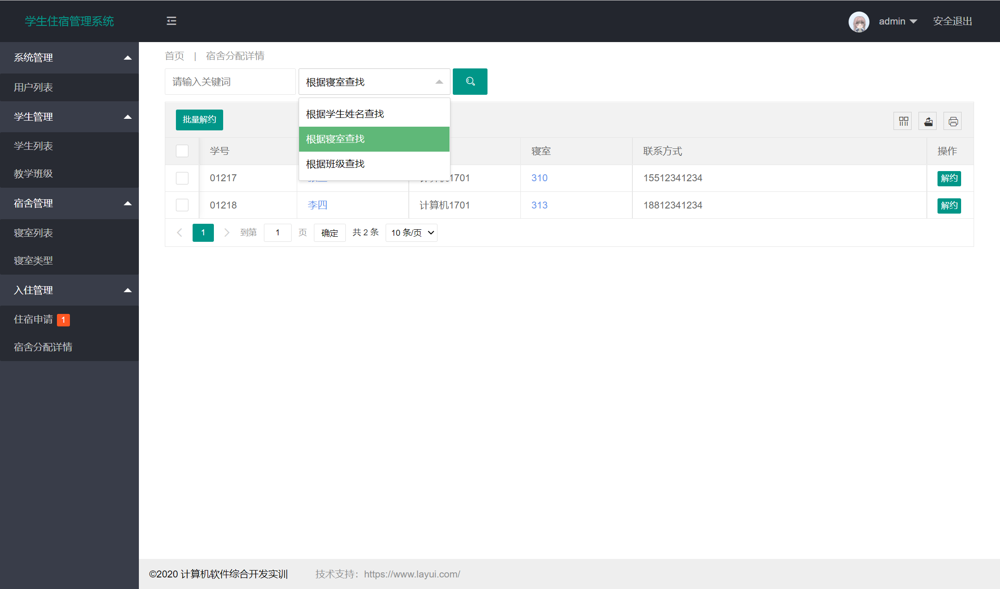

# **学生住宿管理系统**

具体功能与详细文档见《系统设计与实现报告书》,最近用queryDSL重构了一下后端代码

### 运行项目代码的步骤：

(1) 安装git,使用git命令将项目克隆到本地  

```bash
git clone https://gitee.com/ashinigit/Student-Dormitory-Management-System.git
```


(2) 修改 src/main/resources/application.yml 这个文件中的配置信息  

```yaml
url: jdbc:mysql://localhost:3306/db_sdms?useSSL=true&characterEncoding=utf-8&serverTimezone=Asia/Shanghai
username: root                       <--这个要改成本地MySQL中的用户名
password: 123456                     <--这个要改成本地MySQL中的密码
```

```yaml
picture:
  path: C:/Users/用户名/Desktop/Student-Dormitory-Management-System/picture-path/       <--这个要改成picture-path这个文件夹在你电脑上的绝对路径  
```
yml文件的语法    https://www.cnblogs.com/lxhaaron/p/12807473.html

```yaml
易错点1           path冒号空格C:/Users/ ...                        冒号和C之间必须有空格  

易错点2           路径必须是以盘符开头的绝对路径         路径必须要以左斜杠"/"结尾
```


(3)在MySQL中创建一个名叫db_sdms的数据库，字符集设置utf8。在新建的db_sdms数据库中运行db_sdms.sql这个SQL文件，目的是将表结构和初始化数据导入到数据库中。  
建议使用数据库连接工具navicat完成操作，提供一个绿色版：https://pan.baidu.com/s/1a90JhOe3J7jYiJqoia9QAg  提取码：r7yv


(4)用开发工具IDEA（或eclipse）打开项目：
 - 用IDEA打开项目，建议将项目的JDK版本设置为1.8 。  
刷新Maven下载依赖时，如果下载速度慢，参考https://blog.csdn.net/m0_60128869/article/details/120286322 配置阿里云镜像。
 - 用eclipse打开项目，需要为eclipse安装lombok插件，参考https://blog.csdn.net/m0_60128869/article/details/120285341     


(5)运行 SdmsApplication.java 启动项目。在浏览器中访问 http://localhost:8080/ 

```
管理员   username=admin   password=123

学生     username=01217   password=01217

注意:在数据库中密码采用了MD5加盐单向加密,盐值就是用户各自的username 
```
**新增一个学生，系统会自动创建用户名和密码都是学号的账户。**


### 配置项目：

(1)后端运行的端口号可在 src/main/resources/application.yml 中修改(注意空格)，必须同步修改前端的文件上传接口 

(2)前端的文件上传接口在 src/main/resources/static/js/upload.js 中配置，默认使用的是本地上传，后端代码见 [src/main/java/com/sdms/controller/FileUploadController.java](https://gitee.com/ashinigit/Student-Dormitory-Management-System/blob/master/src/main/java/com/sdms/controller/FileUploadController.java)       

(3)如果需要修改页面底部的文字  `©2020 计算机软件综合开发实训  技术支持：https://www.layui.com/ ` 可以在src/main/resources/static/js/footer.js 中配置。**如果修改后没有生效，可能是因为IDEA存在缓存，可以通过手动删除`target`文件夹或使用`mvn clean`命令来解决问题。**      

(4)运行项目会自动打开浏览器访问，在 SdmsApplication.java 中配置自动访问的URL    


### 用到的技术：

```
(0)Lombok 偷懒神器
(1)Spring Boot v2.5.3 
(2)Spring Data JPA 的 hibernate实现 + queryDSL
(3)shiro 用于授权与认证  
(4)Thymeleaf 服务器端模板引擎  
(5)layui 布局前端界面 
(6)jQuery 简化Dom操作与Ajax请求
```


### 项目预览：








### 项目评价： 

```
权限控制这一块没做完，索性把代码都注释掉了。

为了快速实现逻辑，很多本可以进行查询优化的地方直接用的全表扫描。    

代码的架构比较混乱，controller层包含了大量的业务逻辑，可拓展性比较差。  
```

最近学习了一下queryDSL，想起了大四的时候做的这个程序，于是重构了一下后端的代码


